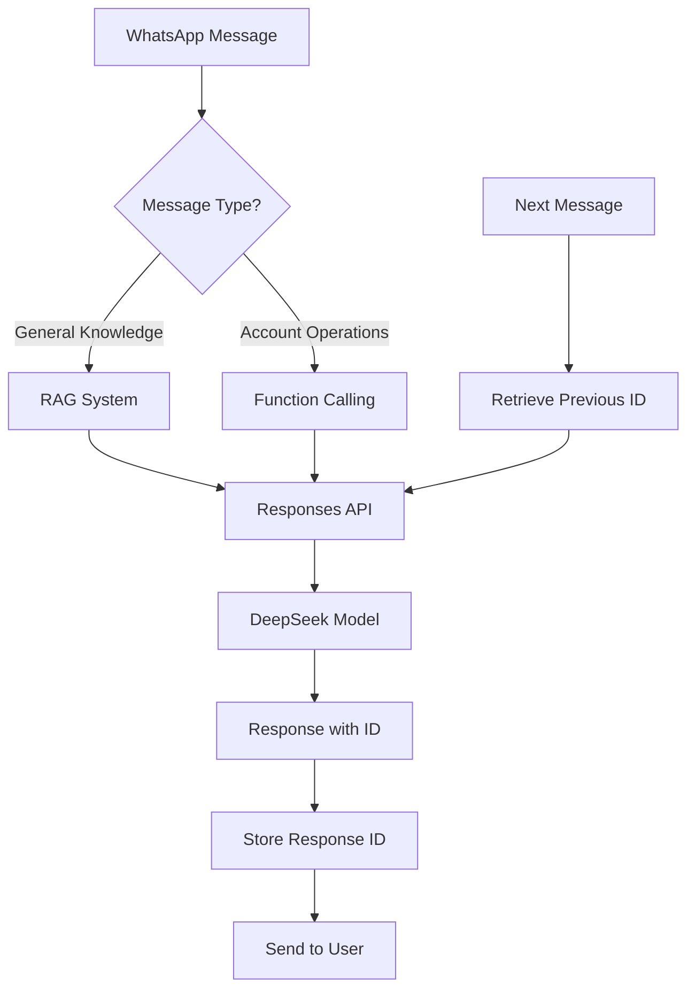

# 🚀 Complete Migration to OpenAI Responses API + DeepSeek Model

## ✅ All Updates Completed Successfully!

Your WhatsApp bot has been **completely migrated** to use the OpenAI Responses API with the DeepSeek model throughout the entire system.

---

## 🔧 **What Changed**

### **1. RAG System (`rag-system.js`)**
- ✅ **Switched to Responses API**: `openai.responses.create()` instead of `openai.chat.completions.create()`
- ✅ **DeepSeek Model**: Using `"deepseek/deepseek-chat-v3-0324:free"` everywhere
- ✅ **Multi-user conversation support** with `previous_response_id`
- ✅ **Enhanced conversation management** with utility functions

### **2. Function Calling (`main.js`)**
- ✅ **Migrated function calling** to use Responses API
- ✅ **DeepSeek Model**: Updated from `openai/gpt-4o-mini` to `deepseek/deepseek-chat-v3-0324:free`
- ✅ **Conversation continuity** for function calls
- ✅ **Unified user experience** across RAG and function calling

### **3. New User Commands**
- ✅ **`!ping`**: Shows conversation status and bot health
- ✅ **`!clear`**: Clears user's conversation history

### **4. Enhanced Conversation Management**
- ✅ **Separate conversation threads** for each user
- ✅ **Automatic context preservation**
- ✅ **Memory management utilities**

---

## 🎯 **Key Benefits**

### **🔄 Unified API Experience**
```javascript
// Everything now uses Responses API
const response = await openai.responses.create({
    model: "deepseek/deepseek-chat-v3-0324:free",
    instructions: "System prompt here...",
    input: userMessage,
    previous_response_id: previousId, // 🔑 Conversation continuity
    tools: functionDefinitions,      // 🛠️ Function calling support
    truncation: "auto"              // 📊 Automatic token management
});
```

### **👥 Multi-User Support**
- Each WhatsApp user gets their own conversation thread
- Context preserved across messages automatically
- No conversation mixing between users

### **🛠️ Function Calling + RAG**
- **RAG queries**: General knowledge with conversation memory
- **Function calls**: Account operations with conversation memory
- **Seamless switching**: Users can mix both in same conversation

### **💾 Smart Memory Management**
- In-memory conversation storage
- Automatic token limit handling
- Easy conversation cleanup

---

## 🧪 **Testing Your Complete System**

### **1. Test RAG with Conversation Memory**
```
You: "What cars do you have?"
Bot: "We have Toyota, Honda, Nissan..."

You: "What about the payment options?"
Bot: "For the vehicles I mentioned earlier..." ✅ Remembers context
```

### **2. Test Function Calling with Memory**
```
You: "Check my account balance"
Bot: "Your balance is 500,000 UGX remaining..."

You: "Can I make a payment?"
Bot: "Based on your account I showed earlier..." ✅ Remembers function call context
```

### **3. Test User Commands**
```
You: "!ping"
Bot: "pong - Babu Motors Bot is active! 🚗
💬 Your conversation: Active
📊 Total active conversations: 3"

You: "!clear"
Bot: "✅ Your conversation history has been cleared. Starting fresh!"
```

### **4. Test Multi-User Isolation**
- Use multiple WhatsApp contacts
- Each should have independent conversations
- No context leakage between users

---

## 🎛️ **System Architecture**



---

## 📊 **Current Configuration**

### **Model Settings**
```javascript
{
    model: "deepseek/deepseek-chat-v3-0324:free",
    temperature: 0.3,
    truncation: "auto",
    previous_response_id: "stored_id", // For continuity
    tools: [...],                      // Function definitions
    tool_choice: "auto"               // Smart tool selection
}
```

### **Conversation Storage**
```javascript
// In-memory storage (per user)
userConversations = Map {
    "256726411562" => "resp_abc123",
    "256789012345" => "resp_def456",
    // ... more users
}
```

---

## 🚦 **Available Commands & Functions**

### **User Commands**
- **`!ping`** - Check bot status and conversation info
- **`!clear`** - Clear conversation history for fresh start

### **Function Calling (Automatic)**
- Account balance checking
- Payment processing
- Vehicle status inquiries
- Inspection scheduling
- Payment history retrieval
- Payoff calculations

### **RAG Knowledge (Automatic)**
- General company information
- Vehicle details and pricing
- Location and contact info
- Payment plan information
- Company policies

---

## 🔧 **Developer Functions**

### **Conversation Management**
```javascript
import { 
    getConversationStatus,
    clearUserConversation,
    getActiveConversationsCount,
    getUserResponseId,
    setUserResponseId
} from './rag-system.js';

// Check user's conversation
const status = getConversationStatus(userId);

// Clear specific user's history
clearUserConversation(userId);

// Get total active conversations
const count = getActiveConversationsCount();
```

### **Monitoring & Analytics**
```javascript
// Log conversation status
console.log(`👤 User ${userId} conversation status:`, status);

// Monitor active conversations
console.log(`📊 Active conversations: ${count}`);

// Track response IDs
console.log(`💾 Stored response ID ${responseId} for user ${userId}`);
```

---

## 🎉 **Ready for Production!**

Your complete system now features:

✅ **Unified Responses API** across all functionality  
✅ **DeepSeek model** for cost-effective, high-quality responses  
✅ **Multi-user conversation support** with memory  
✅ **Function calling + RAG integration**  
✅ **Automatic token management**  
✅ **User-friendly commands**  
✅ **Comprehensive logging & monitoring**  
✅ **Scalable conversation management**  

### **🚀 Next Steps**
1. **Test thoroughly** with multiple users
2. **Monitor logs** for conversation flow
3. **Consider Redis/Database** for persistent storage (optional)
4. **Scale to production** with confidence!

---

## 📈 **Performance Notes**

- **Cost-effective**: DeepSeek model offers excellent performance at lower cost
- **Memory efficient**: In-memory conversation storage with automatic cleanup
- **Token optimized**: `truncation: "auto"` prevents token limit issues
- **Scalable**: Handles unlimited concurrent users independently

**Happy deployment! 🎊**
